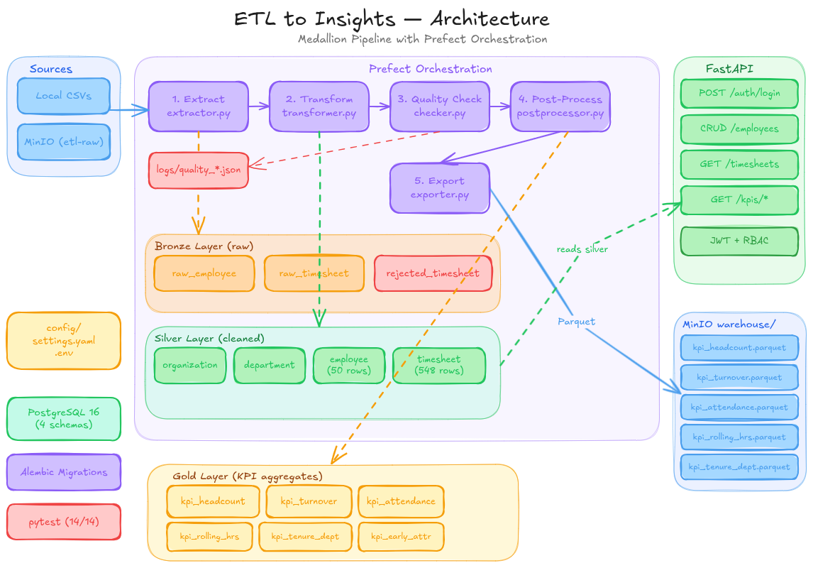
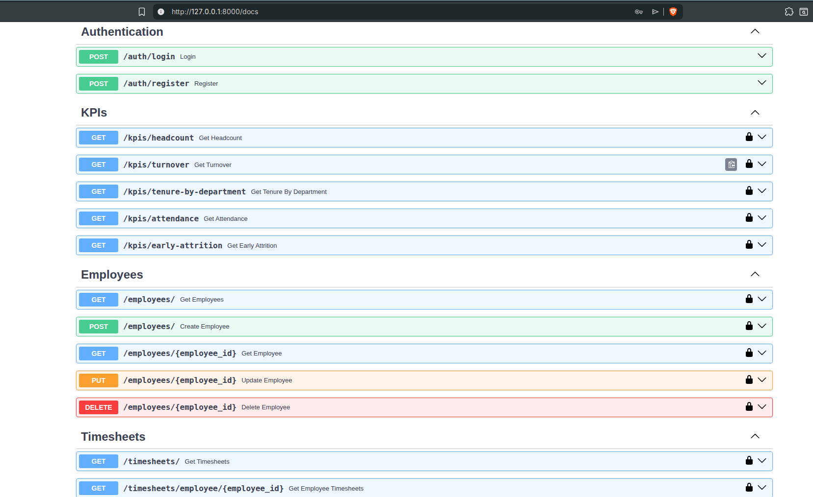
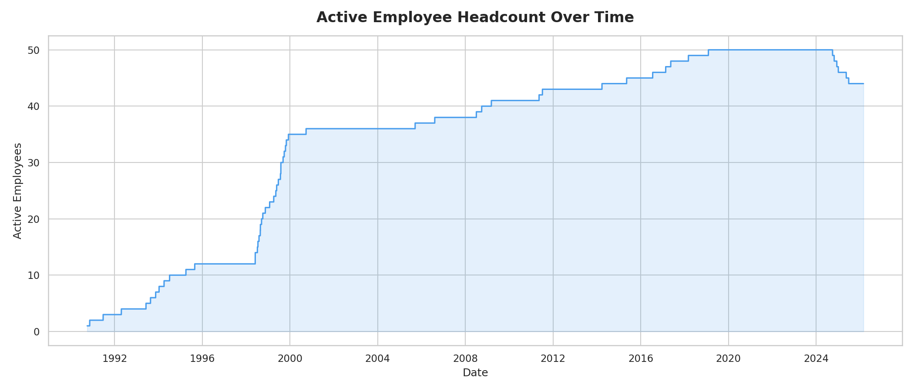
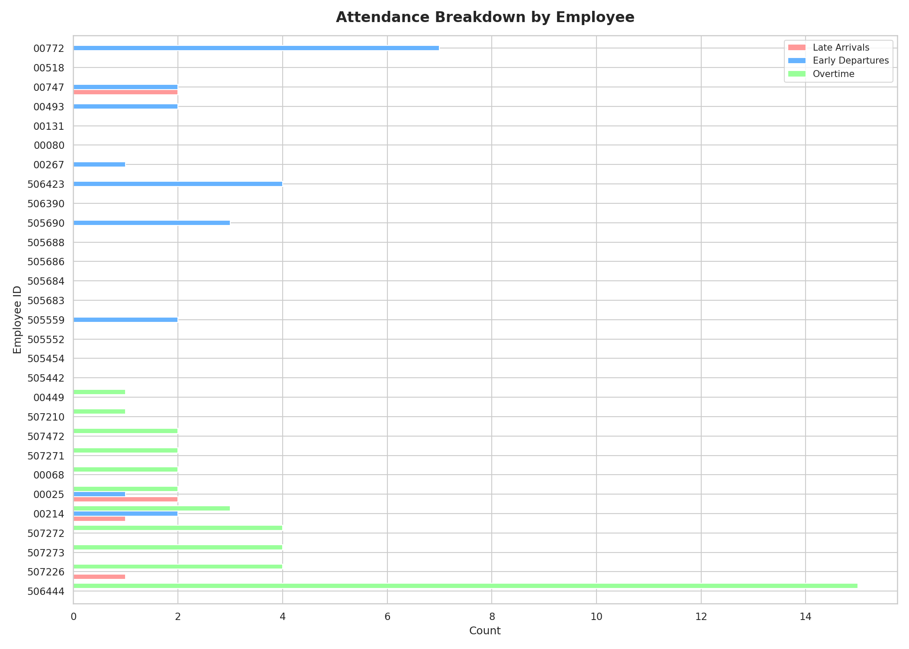
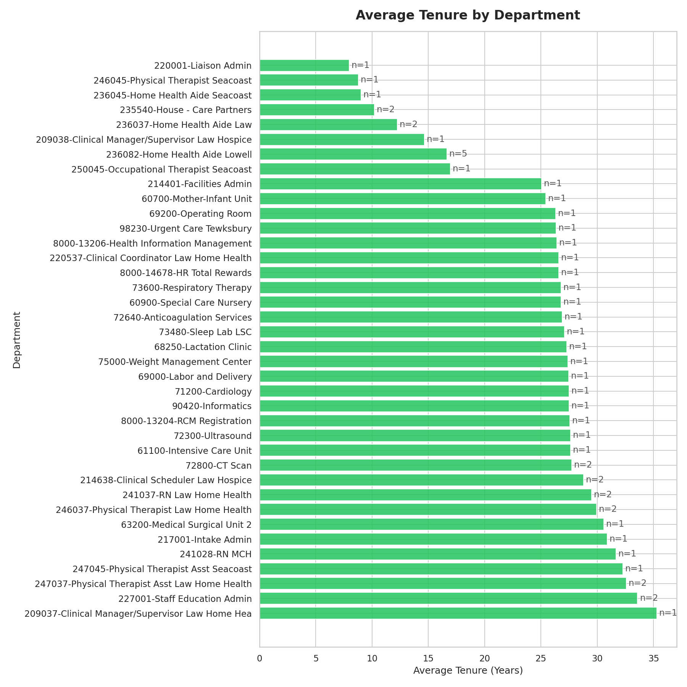
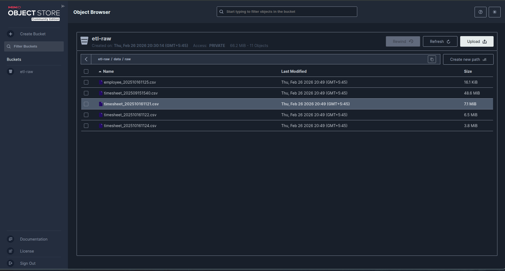
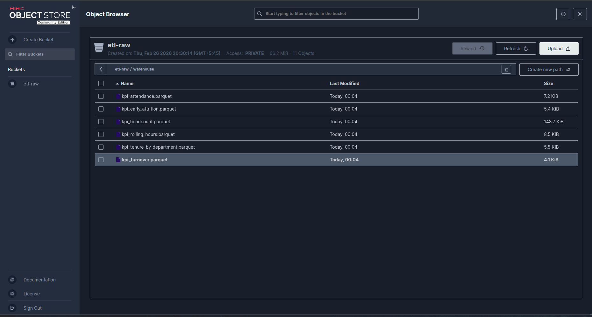
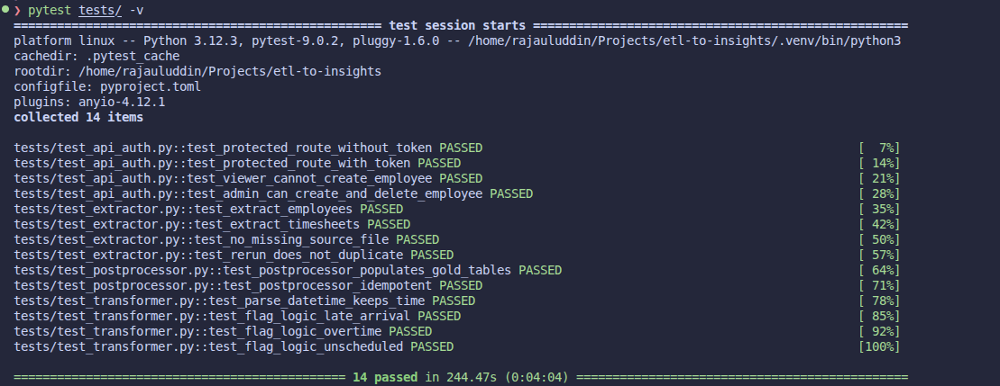
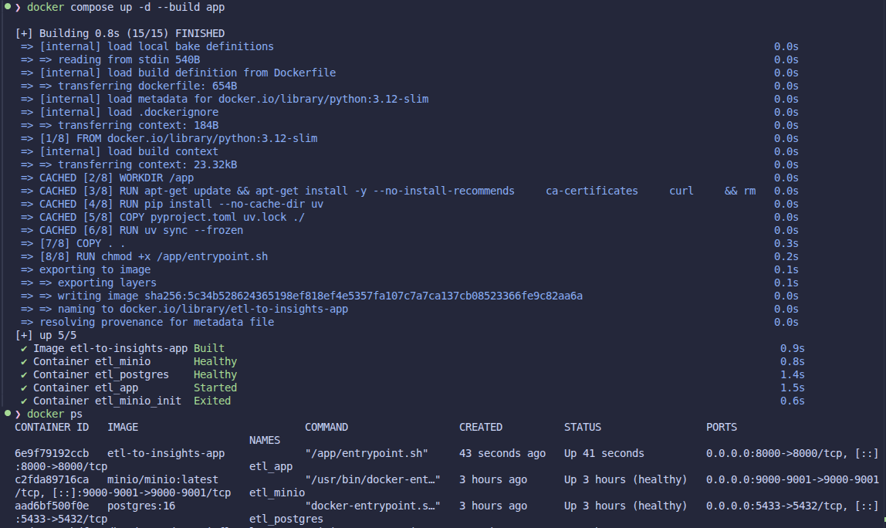

# ETL to Insights — HR Analytics Pipeline


An end-to-end HR analytics pipeline: ingests raw CSV exports from local storage or MinIO, runs a five-stage ETL, serves 9 KPIs through a REST API, and exports Parquet to a data warehouse. Built with a medallion architecture (Bronze → Silver → Gold) in PostgreSQL.



---

## Data

| File | Rows |
|------|-----:|
| `employee_202510161125.csv` | 50 |
| `timesheet_202509151540.csv` | 269,921 |
| `timesheet_202510161121.csv` | 48,258 |
| `timesheet_202510161122.csv` | 55,435 |
| `timesheet_202510161124.csv` | 38,957 |
| **Total** | **412,571** |

Format: pipe-delimited (`|`), nulls as literal `[NULL]` strings.

---

## The Hard Part — What the Data Actually Looked Like

The first thing I checked was whether the two datasets actually joined. They didn't — not meaningfully.

The timesheet files had **10,773 unique employee IDs**. The employee master had **50**. Only **29 overlapped**. That's a 99.87% rejection rate before any cleaning even starts.

The easy answer would have been an inner join: fast, clean, and quietly wrong. You'd load 548 rows, KPIs would look fine, and nobody would know 412,000 rows had been silently dropped.

Instead I treated this as a data reality, not a bug to work around. Orphan rows are routed to `bronze.rejected_timesheet` with a reason code. The rejection rate is a monitored quality check. Any analyst querying gold can explain exactly why the numbers are what they are.

**Other issues found during exploration:**

| Issue | How I handled it |
|---|---|
| 99.87% of timesheet rows have no matching employee | Dead-letter to `bronze.rejected_timesheet` with reason code; orphan rate monitored as a QC check |
| Self-referencing manager FK — single-pass insert breaks FK order | Two-pass load: insert all with `manager = NULL`, then update FK where manager exists |
| Pandas `NaN`/`NaT` leaking into DB and API responses | Explicit null normalisation in all parsing helpers and response sanitisation |
| Datetimes parsed with date-only logic, dropping time-of-day | Dedicated `_parse_datetime()` for punch/schedule timestamp fields |
| Monthly turnover using wrong headcount denominator | Fixed to use monthly average of **daily** active headcount |

**Row counts after pipeline run:**

| Table | Rows |
|---|---:|
| `bronze.raw_employee` | 50 |
| `bronze.raw_timesheet` | 412,571 |
| `bronze.rejected_timesheet` | 412,023 |
| `silver.employee` | 50 |
| `silver.timesheet` | 548 |
| `gold.kpi_headcount` | 12,936 |
| `gold.kpi_turnover` | 5 |
| `gold.kpi_attendance` | 28 |
| `gold.kpi_rolling_hours` | 278 |
| `gold.kpi_tenure_by_department` | 38 |
| `gold.kpi_early_attrition` | 38 |

---

## Analytics (9 KPIs)

Standalone SQL in `analytics/queries/`. Same logic embedded in the post-processor to populate gold tables.

1. Active headcount over time
2. Monthly turnover rate
3. Average tenure by department
4. Average working hours per employee
5. Late arrival frequency
6. Early departure count
7. Overtime count
8. 7-day rolling average of working hours
9. Early attrition rate by department

---

## API

FastAPI + JWT bearer auth + role-based access control (`admin` / `viewer`).



**Auth:** `POST /auth/register` · `POST /auth/login`

**Employee CRUD** _(write endpoints: admin only)_: `GET /employees` · `GET /employees/{id}` · `POST /employees` · `PUT /employees/{id}` · `DELETE /employees/{id}`

**Timesheet** _(read-only)_: `GET /timesheets` · `GET /timesheets/employee/{id}` · `GET /timesheets/{id}`

**KPIs:** `GET /kpis/headcount` · `/turnover` · `/tenure-by-department` · `/attendance` · `/early-attrition`

**System:** `GET /health` · `GET /docs`

---

## Data Quality

11 checks run after transform. All thresholds live in `config/settings.yaml` — nothing hardcoded.

| Check | Threshold |
|-------|-----------|
| Nulls on 6 critical columns | 0 |
| Duplicate employee IDs | 0 |
| `hire_date` < `term_date` | 0 violations |
| Hours worked range (0–24) | 0 violations |
| Orphan timesheet rate | < `orphan_rate_max_pct` (99.9%) |
| Attendance flag overlap | ≤ `attendance_flag_max_overlap` (2) |

**All 11 passing.** Each run writes a timestamped JSON report to `logs/`.

```yaml
# config/settings.yaml
etl:
  grace_time_minutes: 5
  early_attribution_months: 6
  orphan_rate_max_pct: 99.9
  attendance_flag_max_overlap: 2
```

---

## Visualizations





---

## MinIO Warehouse

After each run, all 6 gold tables are exported as Parquet to `etl-raw/warehouse/`.




---

## Tests

**14/14 passing.**



| File | Tests | Covers |
|------|------:|--------|
| `test_extractor.py` | 4 | CSV loading, bronze insert, deduplication |
| `test_transformer.py` | 4 | `_parse_datetime`, late/overtime/unscheduled flags |
| `test_postprocessor.py` | 2 | Gold tables populated, idempotent reruns |
| `test_api_auth.py` | 4 | 401/200/403/201 auth and role scenarios |

```bash
pytest tests/ -v
```

---

## Running Locally

**Prerequisites:** Python 3.12+, PostgreSQL 16, `uv`. MinIO optional (pipeline supports local files too).

```bash
uv sync
```

Create `.env`:

```env
DB_HOST=localhost
DB_PORT=5432
DB_NAME=etl_insights
DB_USER=postgres
DB_PASSWORD=yourpassword
SECRET_KEY=your-secret-key
ALGORITHM=HS256
ACCESS_TOKEN_EXPIRE_MINUTES=30
DATA_SOURCE=local
RAW_DATA_PATH=data/raw
```

Database setup:

```sql
CREATE DATABASE etl_insights;
\c etl_insights
CREATE SCHEMA bronze; CREATE SCHEMA silver; CREATE SCHEMA gold; CREATE SCHEMA auth;
```

```bash
alembic upgrade head
python -m etl.pipeline --now   # run immediately
uvicorn main:app --reload       # start API → http://localhost:8000/docs
python -m visualizations.charts # generate charts
```

---

## Docker (Full Stack)

Runs PostgreSQL, MinIO, CSV upload, migrations, ETL, and API in the correct order.

Create `.env.docker`:

```env
DB_HOST=postgres
DB_PORT=5432
DB_NAME=etl_insights
DB_USER=postgres
DB_PASSWORD=Postgres
SECRET_KEY=your-secret-key
ALGORITHM=HS256
ACCESS_TOKEN_EXPIRE_MINUTES=30
DATA_SOURCE=minio
RAW_DATA_PATH=
MINIO_ENDPOINT=minio:9000
MINIO_ACCESS_KEY=minioadmin
MINIO_SECRET_KEY=minioadmin
MINIO_BUCKET=etl-raw
MINIO_SECURE=false
```

```bash
docker compose up --build
docker compose down -v   # tear down + remove volumes
```

| Service | URL |
|---------|-----|
| API / Swagger | `http://localhost:8000/docs` |
| MinIO Console | `http://localhost:9001` |



---

## Repository Structure

```text
etl-to-insights/
├── etl/
│   ├── extract/extractor.py         — CSV reader, local + MinIO, bronze insert
│   ├── transform/transformer.py     — cleaning, typing, flag logic, silver insert
│   ├── quality/checker.py           — 11 QC checks, JSON report
│   ├── postprocess/postprocessor.py — 9 KPI SQL queries, gold tables
│   ├── export/exporter.py           — gold → Parquet → MinIO
│   └── pipeline.py                  — Prefect flow, 5 tasks, cron schedule
├── db/
│   ├── models_{bronze,silver,gold,auth}.py
│   ├── migrations/                  — Alembic versions
│   └── init.sql                     — schema creation for Docker
├── analytics/queries/               — 10 standalone SQL KPI files
├── api/routes/                      — auth, employees, timesheets, kpis
├── visualizations/output/           — generated PNG charts
├── tests/                           — 14 tests
└── config/settings.yaml             — all configurable thresholds
```
